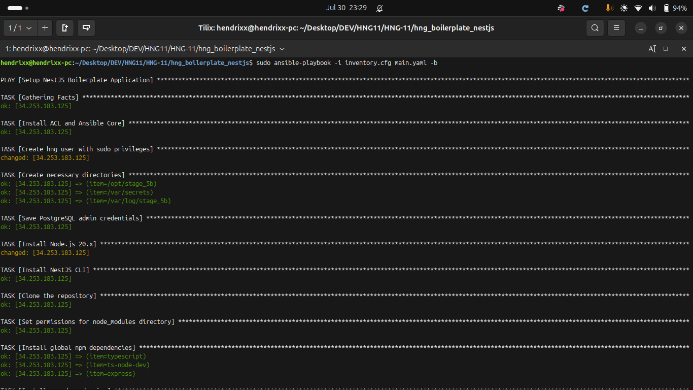
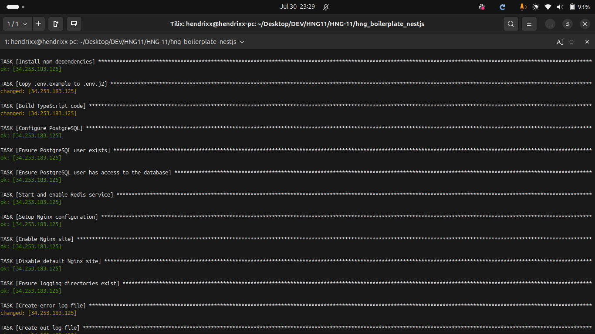
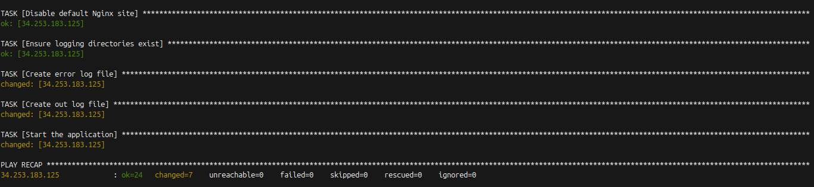
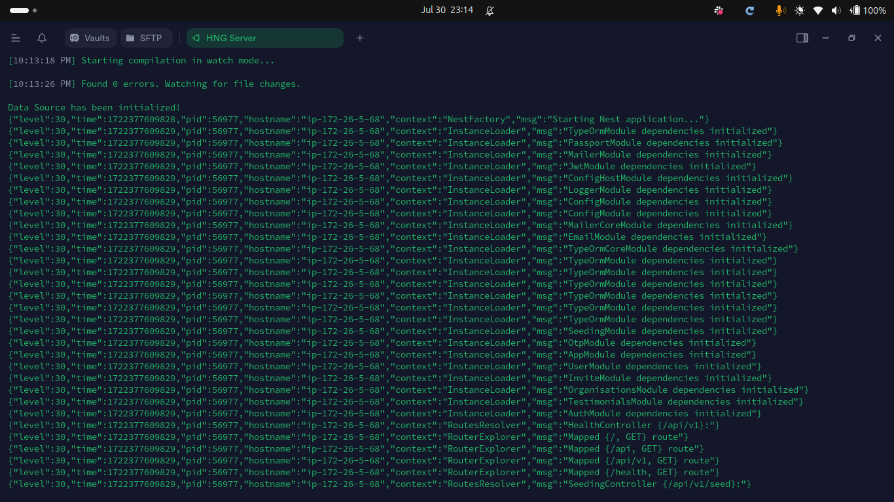
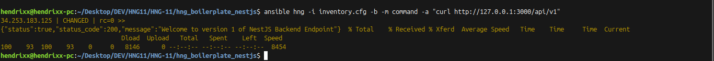
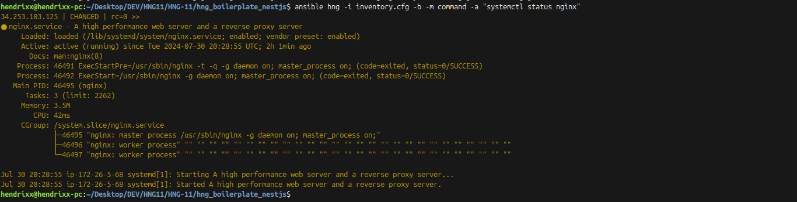
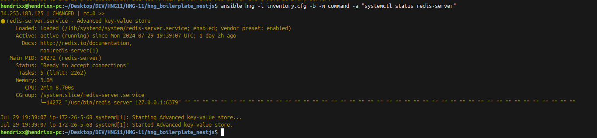

# Automated Deployment and Configuration with Ansible for Boilerplates

## Screenshots
1.

_start of deployment_


_half way through_


_end of deployment_


### Deployment Server
2.

   ```ssh
   sudo -u hng npm run start:dev
   ```


3.

Response on `http://127.0.0.1:3000/api/v1`
   ```ssh
   ansible hng -i inventory.cfg -b -m command -a "curl http://127.0.0.1:3000/api/v1"
   ```
   

4.

runing nginx service
   ```ssh
   ansible hng -i inventory.cfg -b -m command -a "systemctl status nginx"
   ```


5.

runing redis service
   ```ssh
   ansible hng -i inventory.cfg -b -m command -a "ystemctl status redis-server"
   ```


<hr>

## Ansible Playbook: Setup NestJS Boilerplate Application

This Ansible playbook sets up a NestJS boilerplate application on a server. It configures various services, installs necessary packages, and prepares the application environment.

### Overview

- **Hosts**: `hng` - The target hosts where the playbook will be executed.
- **Become**: `true` - Indicates that the tasks should be executed with elevated privileges (sudo).
- **Variables**: Defines the PostgreSQL user, password, database, application directory, user, and Node.js version.

### Variables

- `pg_user`: PostgreSQL username (`devops`).
- `pg_password`: PostgreSQL password (`hendrixx`).
- `pg_db`: PostgreSQL database name (`hendrixxd`).
- `app_dir`: Directory for the application (`/opt/stage_5b`).
- `app_user`: User for the application (`hng`).
- `node_version`: Node.js version (`20.x`).

### Tasks

1. **Install ACL and Ansible Core**
   - **Package Manager**: `apt`
   - **Purpose**: Installs ACL and Ansible Core packages.
   - **State**: Present
   - **Cache Update**: Yes

2. **Create `hng` User with Sudo Privileges**
   - **Module**: `user`
   - **Purpose**: Creates a user named `hng` with sudo privileges and sets up the home directory.
   - **Password**: Hashes the password using SHA-512.

3. **Create Necessary Directories**
   - **Module**: `file`
   - **Purpose**: Creates directories required for the application, secrets, and logs.
   - **Permissions**: `0755`
   - **Owner**: `hng`
   - **Group**: `hng`

4. **Save PostgreSQL Admin Credentials**
   - **Module**: `copy`
   - **Purpose**: Saves PostgreSQL credentials to a secure file (`/var/secrets/pg_pw.txt`).
   - **Permissions**: `0600`

5. **Install Node.js 20.x**
   - **Module**: `shell`
   - **Purpose**: Installs Node.js version 20.x using a setup script from NodeSource.

6. **Install Required Packages**
   - **Package Manager**: `apt`
   - **Purpose**: Installs various packages including Git, npm, PostgreSQL, Redis, Nginx, and Python libraries.
   - **State**: Present
   - **Cache Update**: Yes

7. **Install NestJS CLI**
   - **Module**: `npm`
   - **Purpose**: Installs the NestJS CLI globally.

8. **Clone the Repository**
   - **Module**: `git`
   - **Purpose**: Clones the NestJS boilerplate repository to the application directory.
   - **Branch/Version**: `devops`
   - **Force**: Yes

9. **Set Permissions for `node_modules` Directory**
   - **Module**: `file`
   - **Purpose**: Sets permissions for the `node_modules` directory to ensure the `hng` user can access it.
   - **Permissions**: `0755`

10. **Install Global npm Dependencies**
    - **Module**: `npm`
    - **Purpose**: Installs global npm dependencies including TypeScript, ts-node-dev, and Express.

11. **Install npm Dependencies**
    - **Module**: `npm`
    - **Purpose**: Installs npm dependencies for the application located in `/opt/stage_5b`.

12. **Copy `.env.example` to `.env`**
    - **Module**: `copy`
    - **Purpose**: Copies the `.env.example` file to `.env` in the application directory.
    - **Permissions**: `0600`

13. **Build TypeScript Code**
    - **Module**: `command`
    - **Purpose**: Builds the TypeScript code using the `npm run build` command.

14. **Configure PostgreSQL**
    - **Module**: `postgresql_db`
    - **Purpose**: Configures a PostgreSQL database with specified encoding and locale settings.

15. **Ensure PostgreSQL User Exists**
    - **Module**: `postgresql_user`
    - **Purpose**: Ensures that the PostgreSQL user exists with the specified password.

16. **Ensure PostgreSQL User Has Access to the Database**
    - **Module**: `postgresql_privs`
    - **Purpose**: Grants the PostgreSQL user full privileges to the specified database.

17. **Start and Enable Redis Service**
    - **Module**: `service`
    - **Purpose**: Starts and enables the Redis server to run on system boot.

18. **Setup Nginx Configuration**
    - **Module**: `template`
    - **Purpose**: Sets up the Nginx configuration using a template file (`nginx.conf.j2`).

19. **Enable Nginx Site**
    - **Module**: `file`
    - **Purpose**: Creates a symbolic link to enable the Nginx site configuration.

20. **Disable Default Nginx Site**
    - **Module**: `file`
    - **Purpose**: Removes the default Nginx site configuration to avoid conflicts.

21. **Ensure Logging Directories Exist**
    - **Module**: `file`
    - **Purpose**: Ensures that the logging directory exists with the proper permissions.

22. **Create Error Log File**
    - **Module**: `file`
    - **Purpose**: Creates an error log file with appropriate permissions.

23. **Create Output Log File**
    - **Module**: `file`
    - **Purpose**: Creates an output log file with appropriate permissions.

24. **Start the Application**
    - Module: `shell`
    - Purpose: Starts the application and redirects logs to specified files.

### Handlers

- **Restart Nginx**
  - Module: `service`
  - Purpose: Restarts the Nginx service to apply configuration changes.
